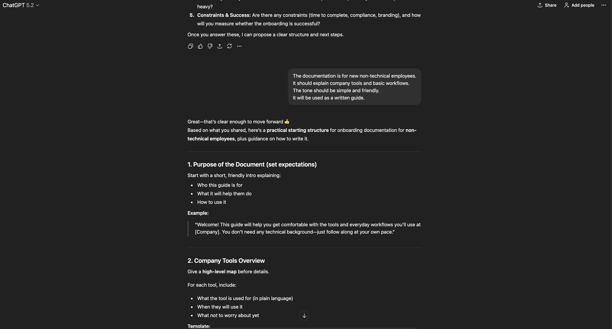
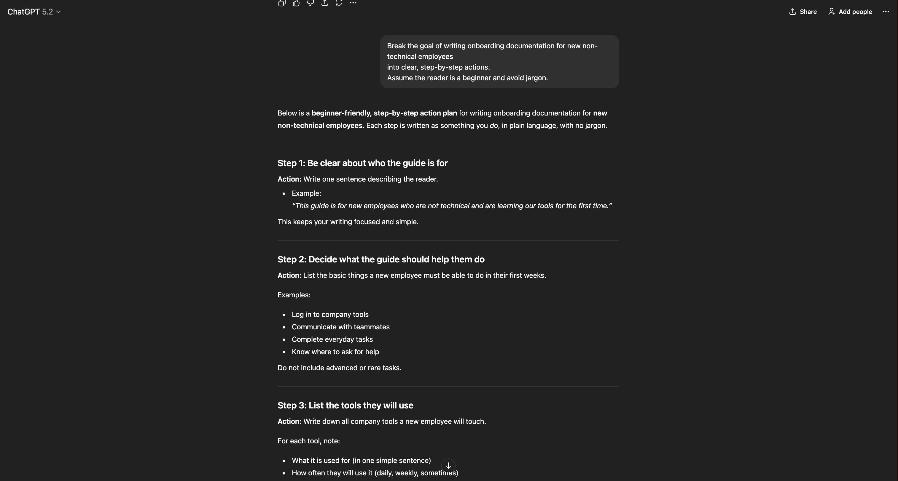
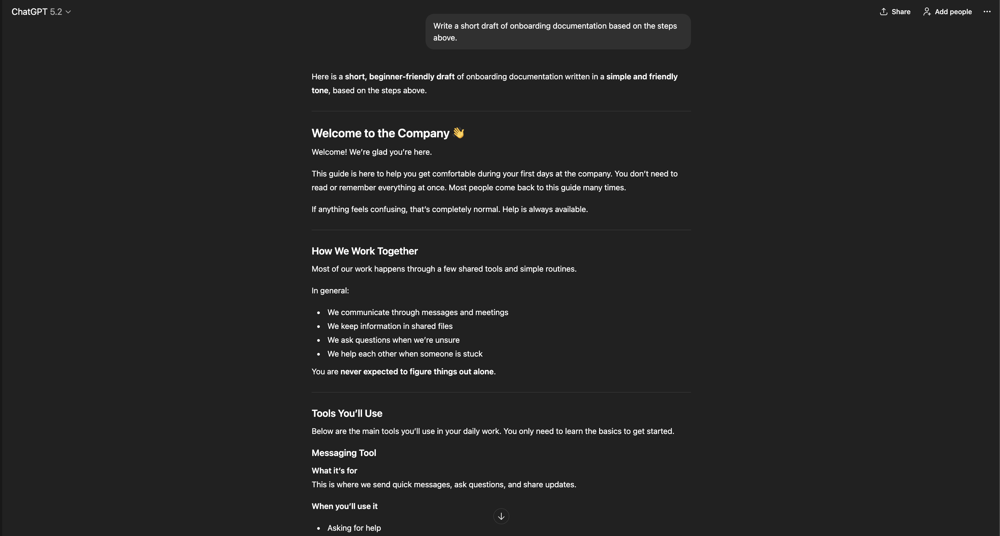

# Prompt Pattern Library

## Overview
This project demonstrates entry-level prompt engineering skills through
a reusable Prompt Pattern Library.

The focus is on:
- Prompt structure
- Output evaluation
- Iteration
- Prompt chaining

## Skills Demonstrated
- Prompt template design
- Output quality evaluation
- Iterative improvement
- Documentation

## What Is a Prompt Pattern?
A prompt pattern is a reusable instruction template that produces
predictable and improvable outputs from large language models.

Each pattern includes:
- Goal
- Prompt template
- Expected output
- Improvement notes

## Core Prompt Patterns
- Clarifier Prompt
- Step-by-Step Planner
- Output Critic
- Rewrite & Improve
- Decision Helper
- Learning Path Designer
- Prompt Improver (Meta)
- Reflection Prompt

## Screenshots & Prompt Chaining Examples

This section shows real examples of how the prompt patterns in this repository
are used in practice. The screenshots demonstrate prompt execution,
output evaluation, and iterative refinement using a single workflow.

### Clarifier Prompt — Reducing Ambiguity

This example shows the **Clarifier Prompt** being used to turn a vague request
(“write onboarding documentation”) into a well-defined goal.

The model asks focused clarification questions about:
- Target audience
- Scope
- Desired outcome
- Format
- Constraints

This step ensures downstream prompts operate on clear requirements rather than assumptions.

---

### Step-by-Step Planner — Task Decomposition

After clarifying the goal, the **Step-by-Step Planner Prompt** is used to break the task
into small, beginner-friendly actions.

The output demonstrates:
- Clear sequencing
- Plain language
- Actionable steps
- Focus on non-technical users

This reduces cognitive load and makes the task easier to execute.

---

### Output Critic — Evaluating Generated Content

This screenshot shows the **Output Critic Prompt** reviewing an AI-generated draft
of onboarding documentation.

The critic evaluates the output for:
- Clarity
- Completeness
- Tone
- Potential points of confusion

This step treats AI output as a **draft to be reviewed**, not a final answer.

---

### Prompt Chaining Workflow (End-to-End)

For a complete view of the full prompt chaining workflow
(Clarifier → Planner → Draft → Critic),
see the PDF below:

**Prompt Chaining Workflow (Full Chat Export)**  
[Onboarding Documentation Clarification – Full Workflow (PDF)](screenshots/Onboarding_Documentation_Clarification.pdf) :contentReference[oaicite:0]{index=0}

This document shows the entire interaction in one continuous flow,
demonstrating how prompts build on each other and how outputs improve
through iteration rather than one-shot prompting.

---

### Why This Matters

These examples demonstrate key entry-level prompt engineering skills:
- Designing reusable prompt templates
- Reducing ambiguity before generation
- Evaluating outputs against clear criteria
- Iterating through prompt chains
- Documenting process and decisions

The focus is on **structured prompting and reliability**, not prompt tricks.
